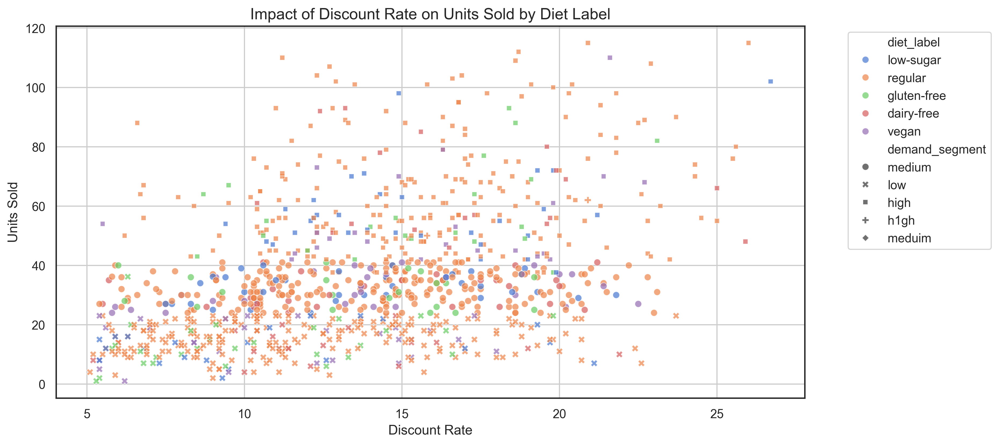
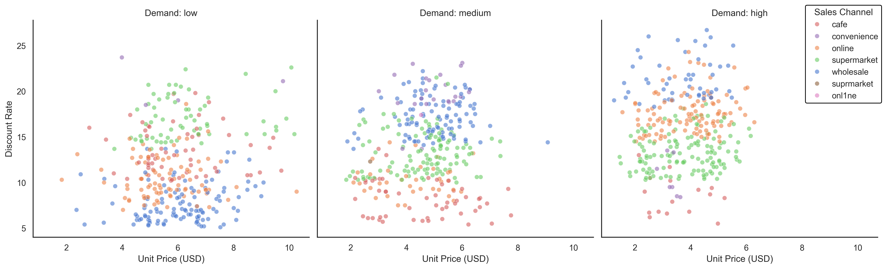
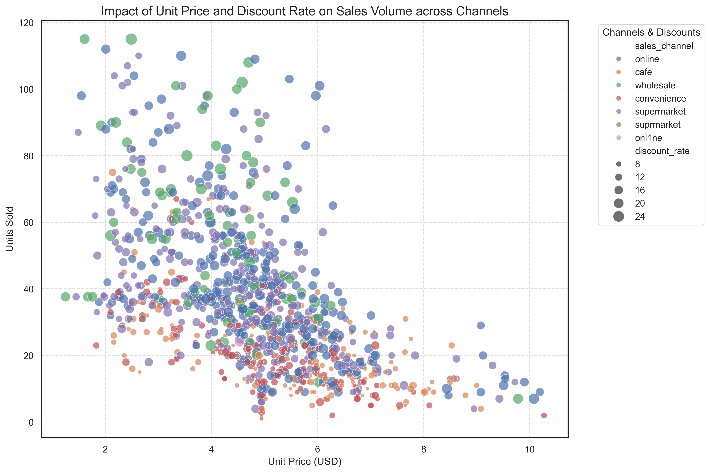
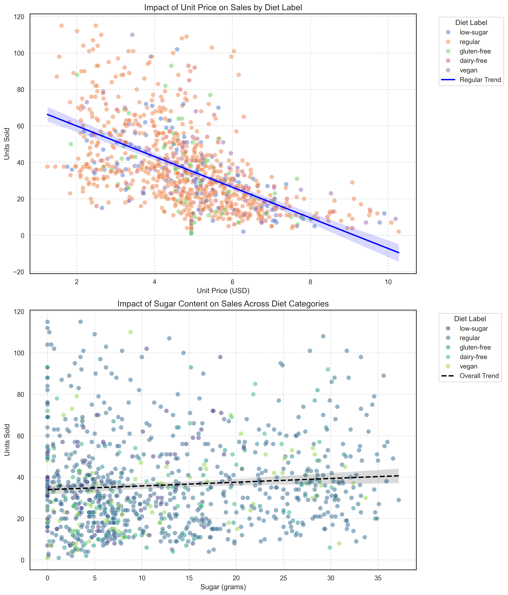

# Project Analysis of Winter Food & Beverages Market (STAT112)

This repository contains the final project for the **STAT112** course. The project focuses on cleaning and analyzing a synthetic dataset representing the winter season performance of food and beverage products.

## Group Members
- **Barış**
- **Ali**
- **Batuhan**
- **Oğuz Kerem Ayhan**

## Project Overview
The goal of this project is to perform a comprehensive data analysis workflow, including:
1.  **Data Cleaning:** Handling "dirty" synthetic data to ensure it is tidy and ready for analysis.
2.  **Exploratory Data Analysis (EDA):** Visualizing and interpreting trends in the winter food and beverage market.
3.  **Market Insights:** Analyzing factors like pricing, discount rates, and sales channels to understand demand segments.

## Visualizations (EDA)
Below are the key figures generated from the analysis:

| Category Trends | Price vs Sales |
| :---: | :---: |
|  |  |
| **Nutritional Analysis** | **Segment Analysis** |
|  |  |

## Repository Structure
- `Final_Project_Notebook_v2_BACKUP.ipynb`: The main Jupyter Notebook containing the data cleaning and analysis.
- `data/`: Contains the datasets used and generated.
  - `winter_food_beverages_synthetic_1000_dirty.csv`: The primary raw dataset.
  - `winter_food_beverages_data_description.txt`: Detailed metadata for the dataset.
  - `cleaned_winter_research_data.csv`: The final cleaned version of the dataset.
- `figures/`: Contains visualizations generated during the analysis (`fig1.png` to `fig4.png`).

## How to Run
To view and run the analysis:
1.  Clone this repository.
2.  Ensure you have Jupyter Notebook installed (or use Google Colab / VS Code).
3.  Install necessary Python libraries:
    ```bash
    pip install pandas matplotlib seaborn
    ```
4.  Open `Final_Project_Notebook_v2_BACKUP.ipynb` and run the cells.